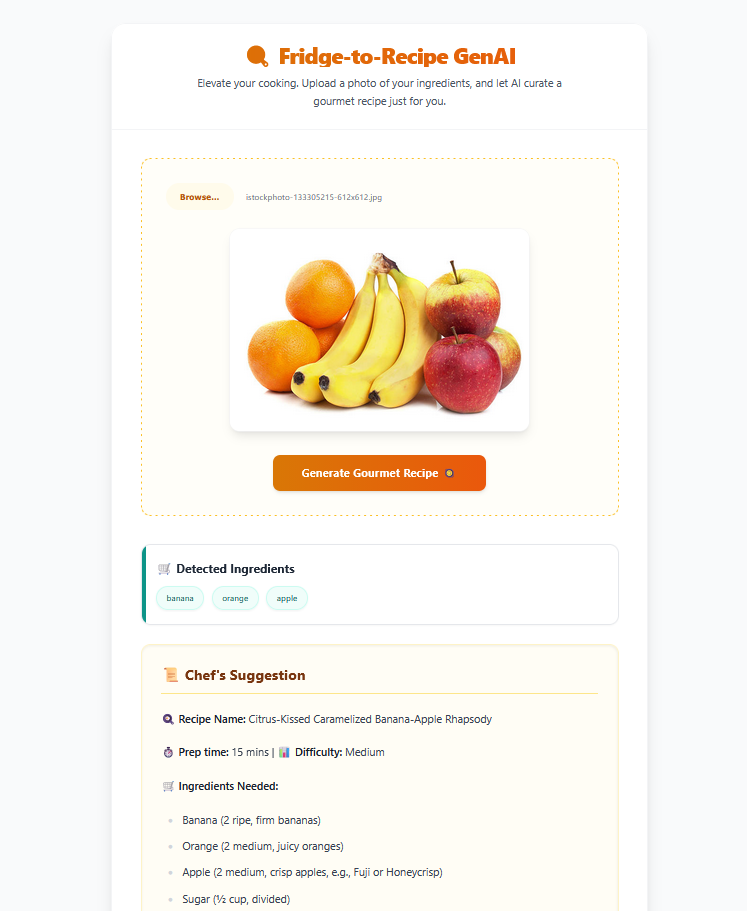
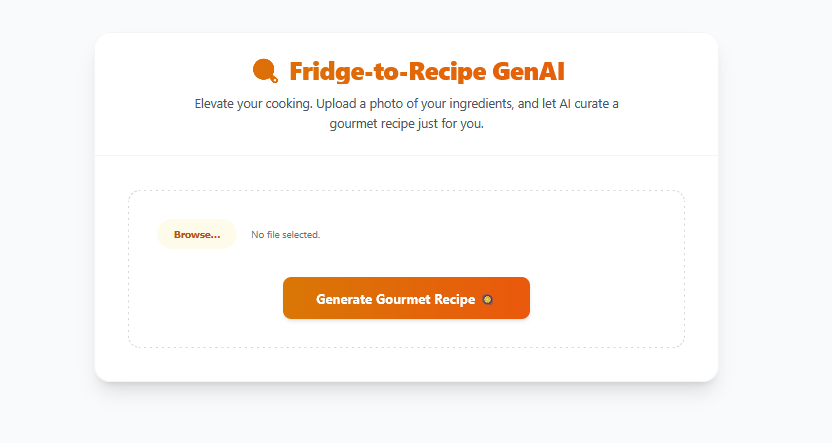
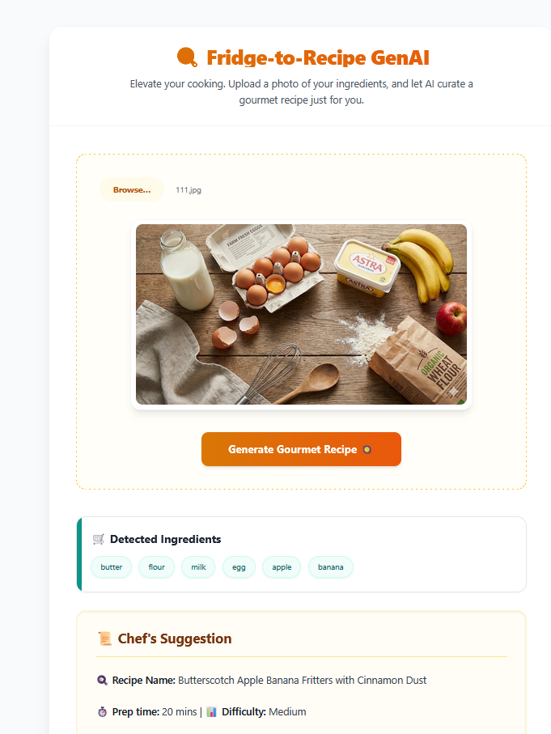
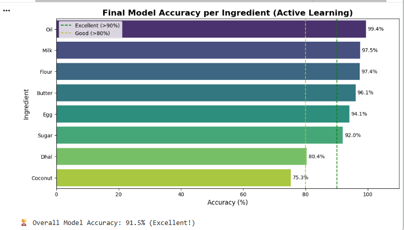

# 🍳 Fridge-to-Recipe GenAI (Smart Chef)



An intelligent full-stack application that helps you decide what to cook! Simply upload a photo of the ingredients in your fridge, and the AI will detect them and generate a gourmet recipe for you.

## 🚀 Features

- **👁️ AI Vision:** Detects ingredients from images using **YOLOv8** Object Detection.
- **🧠 Generative AI:** Generates unique, step-by-step recipes using **Google Gemini 1.5 Flash**.
- **🧹 Smart Filtering:** Automatically ignores non-food items (like tables, bowls, spoons).
- **🎨 Modern UI:** A clean, elegant interface built with **React** & **Tailwind CSS**.
- **⚡ Fast Backend:** Powered by **FastAPI** for high-performance handling.

## 🚀 Advanced Features (New)

- **🧠 Hybrid AI Architecture:** Combines a **Standard YOLOv8s model** (for common items) with a **Custom Fine-tuned YOLOv8 model** (for specific ingredients like flour bowls, butter).
- **🔄 Active Learning Pipeline:** The custom model was improved using active learning strategies—identifying failed detections (e.g., brown eggs, flour in bowls) and re-training with annotated real-world data.
- **🤝 Conflict Resolution Logic:** Implements **IoU (Intersection over Union)** algorithms to resolve conflicts between models (e.g., correctly identifying "Eggs" when the standard model misidentifies them as "Oranges").
- **⚡ Gemini 2.0 Integration:** Upgraded to Google's latest **Gemini 2.0 Flash** model for faster and smarter recipe generation.

## 🛠️ Tech Stack

- **Frontend:** React (Vite), Tailwind CSS
- **Backend:** FastAPI (Python)
- **Computer Vision:** Ultralytics YOLOv8
- **LLM:** Google Gemini API (`gemini-1.5-flash`)

## ⚙️ Installation & Setup

Follow these steps to run the project locally.

### Prerequisites

- Node.js & npm installed
- Python 3.10+ installed
- A Google Gemini API Key (Get it from [Google AI Studio](https://aistudio.google.com/))

### 1. Clone the Repository

```bash
git clone https://github.com/ShanukaAlahakoon/fridge-to-recipe-genai.git
cd fridge-to-recipe-genai
```

### 2. Backend Setup

Navigate to the backend folder and set up the Python environment.

```bash
cd backend
python -m venv venv

# Activate Virtual Environment
# Windows:
venv\Scripts\activate
# Mac/Linux:
source venv/bin/activate

# Install Dependencies
pip install -r requirements.txt
```

⚠️ **Important:** Open `main.py` and replace `YOUR_GEMINI_API_KEY_HERE` with your actual API key.

```bash
# Run the Backend Server
uvicorn main:app --reload
```

The backend will start at `http://127.0.0.1:8000`

### 3. Frontend Setup

Open a new terminal, navigate to the frontend folder.

```bash
cd ../frontend
npm install
npm run dev
```

The frontend will start at `http://localhost:5173`

## 📸 Usage

1. Open the App in your browser.
2. Click on the upload area to select a photo of your ingredients (e.g., vegetables, fruits, eggs).
3. Click "Generate Gourmet Recipe".
4. Wait for the AI to identify items and craft a recipe!

## 📸 Screenshots

### Home Page



### Demo



### Accuracy Analysis


